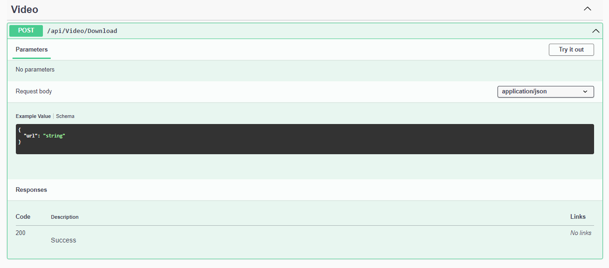
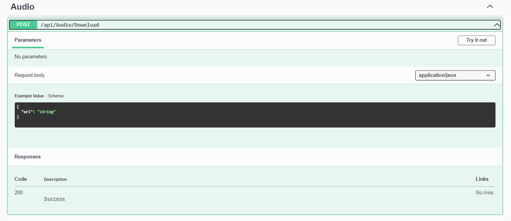

# Download Video and Audio from Youtube

<!--PROJECT_NAME-->

 

  

  <h3 align="center">_Dlp</h3>

  

    Api for dowload Content from Youtube
     
    <a href="#aspnet-core">Imagen Aspnet-Core</a>
  

### Imagen

## Video Download

### Audio Download
